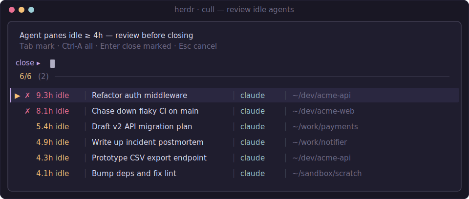

# herdr-cull

Review and close **agent panes** in [herdr](https://herdr.dev) — one overlay,
stale sessions flagged on top, everything else still selectable below.

> **Why "cull"?** In shepherding, to *cull* is to go through the flock and remove
> the animals that shouldn't stay. That's exactly what this plugin does for your
> agents: it rounds up the ones that have gone quiet, shows you the flock, and
> removes only the ones you pick. (It fits herdr's herding theme — and unlike
> "kill", culling is deliberate and reviewed, never automatic.)

If you drive a fleet of coding agents (Claude, Codex, …) across many tabs, some
finish, go quiet, and just sit there for hours. `herdr-cull` gathers them all in
one review overlay — the **stale** ones (idle past a threshold) flagged at the
top, the **active-recently** ones grouped below and still selectable — and closes
only what you pick. Nothing is closed without your say-so.



## Two groups, all selectable

Every non-working agent pane is listed, split into two groups:

- **stale** — idle at least the threshold (default **4h**); flagged gold
  (≥ threshold) or red (≥ 2× threshold) and sorted to the top.
- **active recently** — under the threshold; shown below, unflagged, but still
  selectable so you can close a finished agent without waiting for the timer.

Actively **working** agents are never listed.

## How it measures idle time

herdr knows an agent's *status* (`idle` / `working`) but not *when it last did
something*. So idle time is measured from the modification time of the agent's
**session transcript**, which Claude and Codex append to on every turn:

| Agent  | Transcript looked up at                        | Status              |
| ------ | ---------------------------------------------- | ------------------- |
| Claude | `~/.claude/projects/*/<session-id>.jsonl`      | ✅ fully supported  |
| Codex  | `~/.codex/sessions/YYYY/MM/DD/rollout-*.jsonl` | ⏳ waiting on herdr  |

> **Codex note:** herdr does not yet report a session id for Codex panes, so
> `herdr-cull` can't tie a Codex pane to its rollout file to age it. Rather than
> guess, it lists such panes in the **active-recently** group as `— idle` (age
> unknown) — visible and closable by hand, never mis-aged. The lookup above
> already works and will start aging Codex panes automatically once herdr exposes
> a session handle. Correlating by directory was considered and rejected: two
> Codex panes in the same repo would be indistinguishable, and mis-attributing a
> pane is exactly the mistake this tool exists to avoid.

## Usage

herdr 0.7 does not bind keys from plugin manifests, so add a keybinding to
`~/.config/herdr/config.toml` and run `herdr server reload-config`:

```toml
[[keys.command]]
key = "ctrl+shift+k"
type = "plugin_action"
command = "herdr-cull.open"
description = "Review & close agent panes"
```

Or invoke it directly / from any command palette:

```sh
herdr plugin action invoke herdr-cull.open
```

The overlay is an [fzf](https://github.com/junegunn/fzf) multi-select:

- **Tab** — mark a pane for closing
- **Ctrl-A** — mark all
- **Enter** — close the marked panes
- **Esc** — cancel (closes nothing)

When the marked agent is the only pane in its tab, the whole tab is closed;
otherwise just the pane is removed.

## Configuration

Set the stale threshold (in hours) either way — env wins:

```sh
export HERDR_CULL_IDLE_HOURS=8
```

```toml
# <plugin-config-dir>/config.toml   (herdr plugin config-dir herdr-cull)
idle_hours = 8
```

## Requirements

- herdr ≥ 0.7.0
- **bash** ≥ 3.2, **[jq](https://jqlang.github.io/jq/)**, and coreutils (`stat`, `awk`, `sed`, `find`) — all standard on macOS/Linux
- **[fzf](https://github.com/junegunn/fzf)** — recommended for the multi-select UI.
  Without it, `herdr-cull` falls back to a simple per-pane `[y/N]` prompt.

No compiler, runtime, or build step: it's plain shell + jq.

## Install

```sh
herdr plugin install krzysztoff1/herdr-cull
```

Or, for local development:

```sh
git clone https://github.com/krzysztoff1/herdr-cull
herdr plugin link ./herdr-cull
```

## License

MIT — see [LICENSE](LICENSE).
